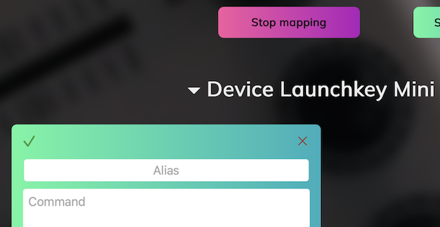

# Help
## Description
This utility allows you to use a MIDI controller to send commands to the terminal. It can be useful for API testing or pet projects. The utility enables quick mapping of any controller's buttons and supports multiple controllers simultaneously.

## Usage
Run the utility as an application (Windows/MacOS) or in a Docker container (Linux) and connect the controller. Open the link [http://localhost:8088](http://localhost:8088) to configure the controller through the web interface.

## Interface

The main page displays all configured MIDI controllers and cards for each controller where button-to-command mappings are set. A demo config is loaded by default, which won’t work with your controller — it’s just for reference.

### Configuring the Controller
To set up your controller:

1. Click the "Start Mapping" button (the button will change color)
   

2. Press a button/turn a knob on the controller. A new card should appear, it will be highlighted and the page will scroll to it
   

3. Fill in the fields:
    - **Alias**: name of the card
    - **Command**: the assigned command. See the demo config for examples
    - **Trigger**: the moment of activation
    - **Timeout**: time after which command execution will be aborted (Not supported on Windows)

4. After filling in the card, click the green check mark in the upper left corner to save. All cards are saved at once
5. Repeat the steps for all required commands. If you pressed a button by mistake, click the red cross in the upper right corner of the card to delete it
6. To finish the setup, click the "Stop Mapping" button. It will return to its original state.

### Normal Mode
Now, pressing the configured buttons will execute the assigned commands. The corresponding card will be highlighted when triggered.

You can close the web page at this point — the program will continue running in the background.

The Mapping mode is only needed to create new cards. You can edit existing cards in normal mode.

## Troubleshooting
**? Controller mapping not working**
- Check the app logs in the console/container. The device should be recognized:
  `2025/05/18 06:55:53 Current: [Launchkey Mini MK3 MIDI Port Launchkey Mini MK3 DAW Port]`
- If it's not recognized, restart the app with the controller connected and check again

**? Command not working**
- Make sure you're not in Mapping mode
- Check that you've saved the configuration (either via "Save configuration" or the green checkmark on any card)
- Check the logs for button press events:
  `2025/05/18 06:59:38 command not found event {Launchkey Mini MK3 MIDI Port 9 49 0} not found`

**? Nothing works**
- Click the “Contact me” button to reach out for support
