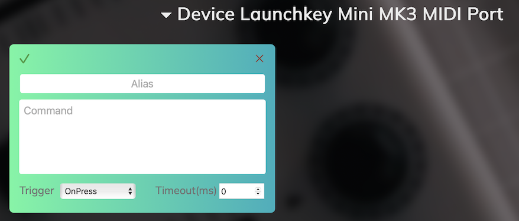

# Справка
## Описание
Утилита позволяет использовать миди контроллер для отправки команд в терминал. Может быть полезна для тестирования API или в пет-проектах. Утилита позволяет быстро замапить кнопки любого контроллера и поддерживает несколько контроллеров одновременно.

## Использование
Запустите утилиту как приложение (Windows/MacOS) или в докер контейнере (Linux) и подключите контроллер. Откройте ссылку [http://localhost:8088](http://localhost:8088) для настройки контроллера в веб интерфейсе.

## Интерфейс

На главной странице отображаются все настроенные миди контроллеры и карточки для каждого контроллера где задается маппинг кнопок на команды. Изначально загружен демо-конфиг который не будет работать с вашим контроллером, он только для ознакомления

### Настройка контроллера
Для настройки вашего контроллера:
1. Нажмите кнопку "Start Mapping" (кнопка поменяет цвет)

2. Нажмите кнопку/поверните ручку на контроллере. Должна появиться новая карточка, она будет подсвечена и страница проскроллится к ней

3. Заполните поля
    - Alias: имя карточки
    - Command: назначенная команда. Смотрите демо конфиг для примеров
    - Trigger: момент срабатывания.
    - Timeout: время через которое выполнение команды будет прервано. (Не работает под Windows)
4. После заполнения карточки нажмите зеленую галку в левом верхнем углу для сохранения. Сохранятся сразу все карточки
4. Повторите шаги для всех требуемых команд. Если вы нажали кнопку случайно, нажмите на красный крест в правом верхнем углу карточки чтобы удалить ее
5. Для завершения настройки нажмите кнопку "Stop mapping", она вернется в изначальное состояние.

### Обычный режим
Теперь по нажатию настроенных кнопок будет выполняться назначенная команда. Соответствующая карточка будет подсвечена при нажатии.

Веб страницу на этом этапе можно закрыть, программа будет работать в фоне

Режим Mapping нужен только для создания новых карточек. Редактировать уже созданные карточки можно и в обычном режиме

## Решение проблем
**? Маппинг контроллера не работает**
- Проверьте логи приложения в консоли/контейнере. Устройство должно определиться `2025/05/18 06:55:53 Current: [Launchkey Mini MK3 MIDI Port Launchkey Mini MK3 DAW Port]`
- Если не определилось, перезапустите приложение с подключенным контроллером и проверьте еще раз

**? Команда не работает**
- Убедитесь что вы не в режиме Маппинг
- Проверьте что вы сохранили настройки (Save configuration или зеленая галка на любой карточке)
- Проверьте что в логах есть события по нажатию кнопки `2025/05/18 06:59:38 command not found event {Launchkey Mini MK3 MIDI Port 9 49 0} not found`

**? Ничего не работает**
- Напишите мне по кнопке Contact me